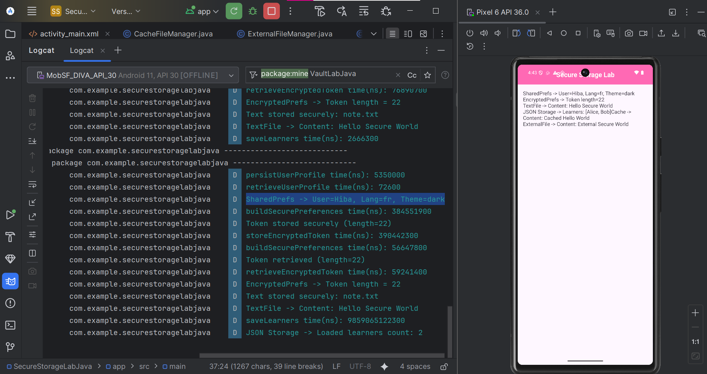
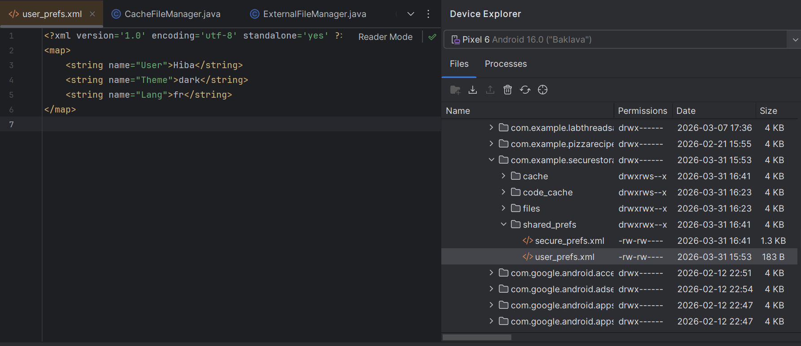
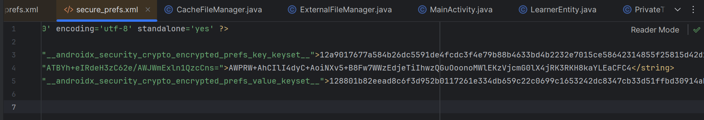
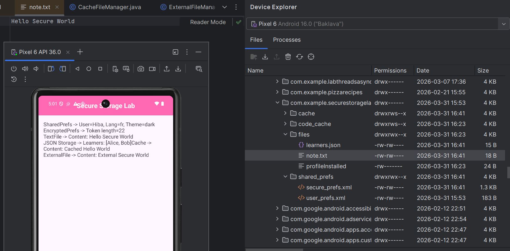
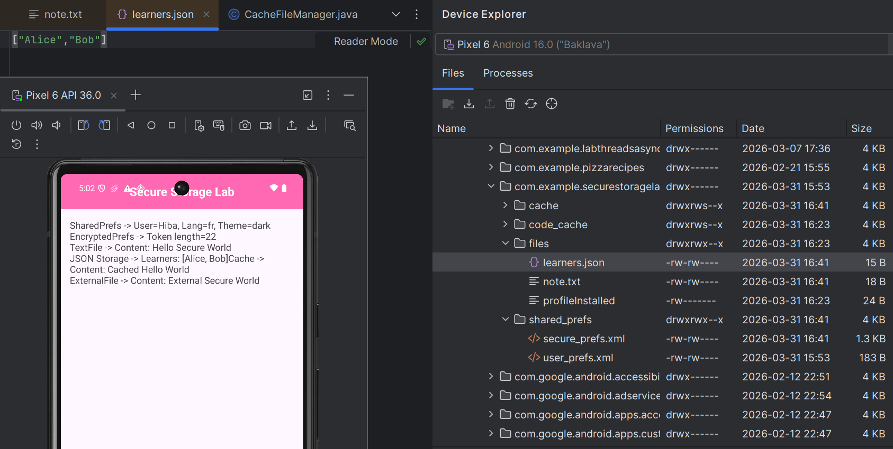
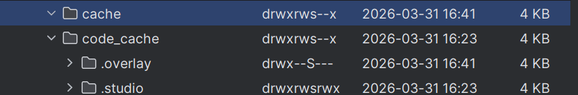
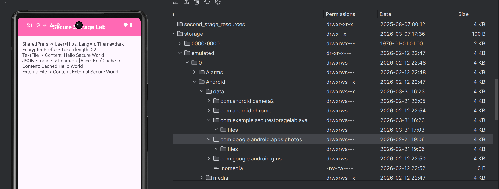

# 🛡️ Secure Storage Lab - Android Security & Persistence

[](https://developer.android.com/)
[](https://www.oracle.com/java/)
[](https://developer.android.com/topic/security/data)
[](https://opensource.org/licenses/MIT)


 
Une application Android (Java) démontrant **tous les principaux mécanismes de stockage local** avec les bonnes pratiques de sécurité — SharedPreferences, EncryptedSharedPreferences, fichiers internes, persistance JSON, cache et stockage externe app-specific.
 
---
 
## 📱 Aperçu
 
| Application en cours | 
|----------------------|
|  | 
---
 
## 🎯 Objectifs d'apprentissage
 
À l'issue de ce lab, vous serez capable de :
 
- Lire et écrire des préférences non sensibles avec `SharedPreferences` (différence entre `apply()` et `commit()`)
- Stocker des secrets (tokens) chiffrés via `EncryptedSharedPreferences` + `MasterKey`
- Écrire et lire des fichiers texte UTF-8 en stockage interne
- Persister et charger des données structurées en JSON avec Gson
- Utiliser `cacheDir` pour des données temporaires et le purger manuellement
- Exporter des fichiers vers le stockage externe app-specific et comprendre le modèle de permissions
- Appliquer une checklist sécurité : pas de secrets en clair, logs contrôlés, nettoyage explicite
 
---
 
## 🏗️ Architecture
 
```
com.example.securestoragelabjava
├── MainActivity.java                  # Point d'entrée — orchestre toutes les démos de stockage
├── prefs/
│   ├── LocalPrefsManager.java         # SharedPreferences (profil utilisateur : nom, langue, thème)
│   └── EncryptedPrefsVault.java       # EncryptedSharedPreferences (token API)
├── files/
│   ├── PrivateTextFileManager.java    # Fichier texte interne (note.txt)
│   ├── LearnersJsonRepository.java    # Fichier JSON via Gson (learners.json)
│   ├── CacheFileManager.java          # Fichiers temporaires dans cacheDir
│   └── ExternalFileManager.java       # Stockage externe app-specific
└── model/
    └── LearnerEntity.java             # Modèle de données
```
 
---
 
## 🧩 Mécanismes de stockage
 
### 1. SharedPreferences — Profil utilisateur non sensible
 
**Classe :** `LocalPrefsManager`  
**Fichier sur l'appareil :** `/data/data/<package>/shared_prefs/user_prefs.xml`
 
Stocke le nom d'utilisateur, la langue et le thème dans un fichier XML en clair, privé à l'application.
 
```java
LocalPrefsManager.persistUserProfile(context, "Hiba", "fr", "dark", false);
UserProfileSnapshot profile = LocalPrefsManager.retrieveUserProfile(context);
```
 
> `apply()` est asynchrone (recommandé pour les préférences UI). `commit()` est synchrone et retourne un booléen — utile lorsqu'une confirmation immédiate d'écriture est nécessaire.
 
**Device File Explorer — `user_prefs.xml` en clair :**
 

 
---
 
### 2. EncryptedSharedPreferences — Stockage sécurisé du token
 
**Classe :** `EncryptedPrefsVault`  
**Fichier sur l'appareil :** `/data/data/<package>/shared_prefs/secure_prefs.xml`
 
Utilise `MasterKey` (appuyé sur le Keystore Android) + `EncryptedSharedPreferences` pour chiffrer clés et valeurs au repos. Le token n'est **jamais loggé** — seule sa longueur est affichée.
 
```java
EncryptedPrefsVault.storeEncryptedToken(context, "1234567890123456789012");
String token = EncryptedPrefsVault.retrieveEncryptedToken(context);
// Logcat affiche : "Token stored securely (length=22)"
```
 
**Contenu sur disque illisible — texte chiffré :**
 

 
---
 
### 3. Fichier texte privé — Stockage interne
 
**Classe :** `PrivateTextFileManager`  
**Fichier sur l'appareil :** `/data/data/<package>/files/note.txt`
 
Écrit du texte UTF-8 directement dans le répertoire de fichiers privés de l'application via `MODE_PRIVATE`.
 
```java
fileManager.writeSecureText("note.txt", "Hello Secure World");
String content = fileManager.readSecureText("note.txt");
```
 
**`note.txt` vérifié dans le Device File Explorer :**
 

 
---
 
### 4. Stockage JSON — Liste des apprenants
 
**Classe :** `LearnersJsonRepository`  
**Fichier sur l'appareil :** `/data/data/<package>/files/learners.json`
 
Sérialise une `List<String>` en JSON via Gson et l'écrit en stockage interne. Retourne une liste vide si le fichier est absent ou corrompu.
 
```java
jsonRepo.saveLearners(List.of("Alice", "Bob"));
List<String> loaded = jsonRepo.loadLearners(); // ["Alice", "Bob"]
```
 
**Contenu de `learners.json` vérifié dans le Device Explorer :**
 

 
---
 
### 5. Stockage Cache — Données temporaires
 
**Classe :** `CacheFileManager`  
**Répertoire sur l'appareil :** `/data/data/<package>/cache/`
 
Écrit du contenu temporaire dans `cacheDir`. Le système (ou l'utilisateur via les Paramètres) peut vider ce répertoire à tout moment — n'y stocker que des données régénérables.
 
```java
cacheManager.writeCache("cache_note.txt", "Cached Hello World");
String cached = cacheManager.readCache("cache_note.txt");
cacheManager.clearCache("cache_note.txt"); // purge explicite
```
 
**Répertoire cache dans le Device Explorer :**
 

 
---
 
### 6. Stockage Externe App-Specific
 
**Classe :** `ExternalFileManager`  
**Répertoire sur l'appareil :** `/sdcard/Android/data/<package>/files/`
 
Utilise `getExternalFilesDir(null)` — aucune permission `READ/WRITE_EXTERNAL_STORAGE` requise sur API 29+. Les fichiers sont supprimés lors de la désinstallation de l'application.
 
```java
extManager.writeExternalFile("external_note.txt", "External Secure World");
String content = extManager.readExternalFile("external_note.txt");
```
 
**Chemin externe visible dans le Device Explorer sous `storage/emulated/0/Android/data/` :**
 

 
---
 
## 🔒 Checklist Sécurité
 
| # | Règle | Statut |
|---|-------|--------|
| 1 | Aucun token/mot de passe n'apparaît dans Logcat — longueur uniquement | ✅ |
| 2 | `EncryptedSharedPreferences` utilisé pour les secrets | ✅ |
| 3 | `MODE_PRIVATE` pour tous les fichiers internes et préférences claires | ✅ |
| 4 | Token masqué dans l'UI (longueur uniquement affichée) | ✅ |
| 5 | Nettoyage complet : prefs + prefs chiffrées + fichiers + cache | ✅ |
| 6 | Cache réservé aux données temporaires régénérables | ✅ |
| 7 | Stockage externe limité au chemin app-specific (pas public) | ✅ |
| 8 | Exceptions gérées sans fuite d'informations sensibles | ✅ |
| 9 | Encodage UTF-8 imposé pour tous les fichiers texte | ✅ |
| 10 | Concept d'expiration du token : timestamp de création + invalidation locale après TTL | ✅ |
| 11 | Vérification effectuée via Device File Explorer | ✅ |
 
---
 
## 🚀 Démarrage
 
### Prérequis
 
- Android Studio (dernière version stable)
- Appareil Android ou émulateur — API 24 minimum
- Aucune connexion Internet requise à l'exécution
 
### Installation
 
1. Cloner le dépôt et l'ouvrir dans Android Studio.
2. Vérifier que les dépendances sont présentes dans `build.gradle` (Module : app) :
 
```groovy
dependencies {
    implementation "androidx.security:security-crypto:1.1.0-alpha06"
    implementation "com.google.code.gson:gson:2.10.1"
}
```
 
3. Synchroniser Gradle, puis **lancer** l'application sur un appareil ou émulateur connecté.
 
### Vérification du stockage
 
Utiliser le **Device Explorer** (Android Studio → View → Tool Windows → Device Explorer) pour naviguer dans :
 
```
/data/data/com.example.securestoragelabjava/
├── cache/              → cache_note.txt
├── files/
│   ├── note.txt        → "Hello Secure World"
│   └── learners.json   → ["Alice","Bob"]
└── shared_prefs/
    ├── user_prefs.xml   → texte en clair (nom, langue, thème)
    └── secure_prefs.xml → texte chiffré (token)
```
 
Fichier externe :
```
/sdcard/Android/data/com.example.securestoragelabjava/files/external_note.txt
```
 
---
 
## 🧹 Nettoyage de toutes les données
 
Appuyer sur le bouton **Tout effacer** dans l'application pour vider chaque emplacement de stockage :
 
- SharedPreferences → `wipePreferences()`
- EncryptedSharedPreferences → `wipeEncryptedVault()`
- Fichier texte interne → `deleteFile("note.txt")`
- Fichier JSON → `deleteFile("learners.json")`
- Cache → `clearCache("cache_note.txt")`
- Fichier externe → `deleteExternalFile("external_note.txt")`

## Démonstration
[https://github.com/user-attachments/assets/e7739886-24ac-44e8-aece-4bc2f44b7f49](https://github.com/user-attachments/assets/758da45c-1cc9-4edf-9114-e74fdf99dce9)

---
 
## 📊 Notes sur les performances
 
Toutes les opérations de stockage sont instrumentées avec un horodatage en nanosecondes dans Logcat (tag `VaultLabJava`). Valeurs observées typiques :
 
| Opération | Durée approximative |
|-----------|---------------------|
| `persistUserProfile` | ~5 ms (1er appel) / ~0,07 ms (suivants) |
| `buildSecurePreferences` (init EncryptedPrefs) | ~385 ms (1er) / ~57 ms (suivants) |
| `storeEncryptedToken` | ~390 ms |
| `retrieveEncryptedToken` | ~59 ms |
| `saveLearners` (JSON) | ~9 ms |
 
> L'initialisation d'`EncryptedSharedPreferences` est coûteuse — il est conseillé de l'initialiser une seule fois au démarrage de l'application plutôt qu'à chaque accès.
 
---
 
## 📚 Concepts clés
 
**`apply()` vs `commit()`**  
`apply()` écrit de manière asynchrone sur disque — pas de valeur de retour, sans bloquer le thread principal. `commit()` écrit de manière synchrone et retourne `true`/`false`. Utiliser `apply()` pour les préférences UI courantes ; utiliser `commit()` uniquement lorsqu'une garantie d'écriture est nécessaire avant l'opération suivante.
 
**Pourquoi `MODE_PRIVATE` ?**  
Tout autre mode (`MODE_WORLD_READABLE`, `MODE_WORLD_WRITEABLE`) est déprécié et dangereux. `MODE_PRIVATE` garantit que seul l'UID de votre application peut accéder au fichier.
 
**Pourquoi ne pas stocker les tokens dans des SharedPreferences classiques ?**  
Sur les appareils rootés ou via la sauvegarde ADB, les fichiers `shared_prefs/*.xml` sont accessibles en clair. `EncryptedSharedPreferences` chiffre clés et valeurs avec AES-256-GCM, la clé maître étant stockée dans le Keystore Android (matérielle sur les appareils compatibles).
 
**Expiration du token**  
Stocker un timestamp `created_at` avec le token. À chaque chargement, comparer avec un TTL (ex. : 24 heures). Si expiré, vider le vault et forcer une nouvelle authentification.
 
---
 
## 📄 Licence
 
MIT — libre d'utilisation à des fins pédagogiques.

