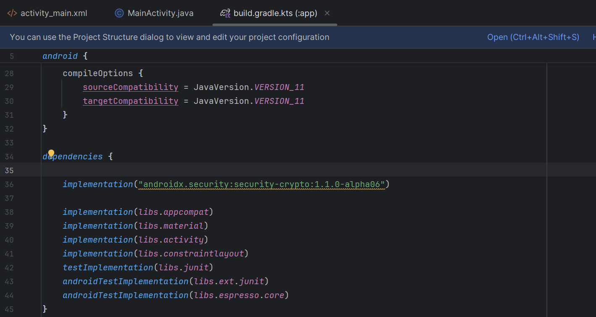
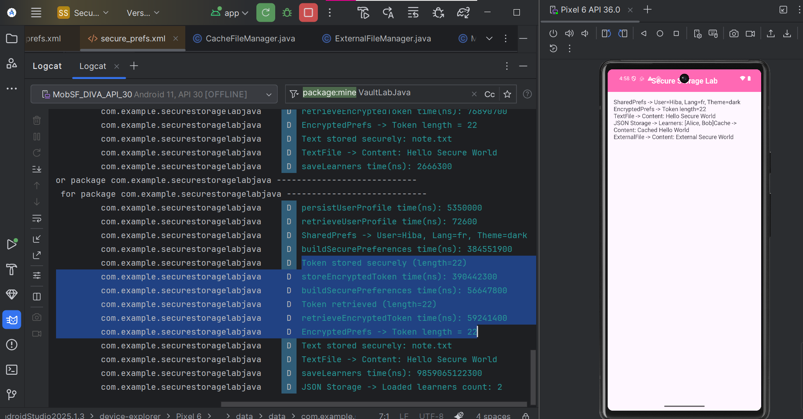
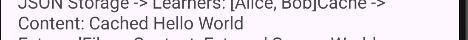

<div align="center">

# 🛡️ Secure Storage Lab
**Un laboratoire d'apprentissage interactif pour la gestion sécurisée des données sur Android.**


</div>

<br/>

## 📝 Description du Projet

**Secure Storage Lab** est une application Android open-source conçue pour démontrer les meilleures pratiques en matière de gestion de données et de stockage sur Android. L'objectif principal de ce projet est de montrer comment manipuler différentes méthodes de stockage tout en respectant les normes de sécurité en vigueur. 

Pratique pour un cas d'usage allant de l'enregistrement de l'état d'une application à la sauvegarde de fichiers sensibles via chiffrement matériel, cette application couvre plusieurs exemples concrets utilisant des architectures logicielles modernes.

---

## 🏗️ Fonctionnalités & Sécurité

L'application aborde de bout en bout l'écosystème de persistance Android en mettant l'accent sur les éléments suivants :

- 🔒 **EncryptedSharedPreferences:** Utilisation de Jetpack Security pour chiffrer les clés et les valeurs. Assure la protection des préférences de l'utilisateur contre l'extraction via ADB sur les appareils non-rootés.
- 📂 **Stockage de Fichiers Privés:** Sauvegarde de fichiers de configuration à l'intérieur du stockage interne privé de l'application (isolé des autres applications).
- 📄 **Stockage sous format JSON:** Conversion d'objets (ex: Entités métier) et sauvegarde en texte clair ou chiffré formaté en JSON avec l'aide de Google **Gson**.
- ⚡ **Gestion du Cache (Cache File Management):** Création, lecture et nettoyage des fichiers temporaires pour optimiser la mémoire et les performances sans saturer l'espace disque.
- 💾 **Stockage Externe (External Storage):** Écriture et manipulation sécurisée de fichiers dans les répertoires publics (Downloads/Documents) en gérant correctement les permissions selon la version d'Android.

---

## 🎥 Démonstration Vidéo

Voici un aperçu de l'usage général de l'application en conditions réelles :

<div align="center">
  <video src="images/lab14.mp4" width="250" controls></video>
</div>

---

## 📱 Captures d'écran & Navigation

<div align="center">
  
  
  
  
</div>
<br/>
<div align="center">
  
  
  
  
</div>

> _Les écrans mettent en évidence les intéractions utilisateur, comme les champs de formulaires et les boutons d'action de sauvegarde, de lecture et de suppression._

---

## 🛠️ Technologies Utilisées

- **Android SDK** (Min API 24, Target API 36)
- **Langage:** Java 11 ☕
- **Jetpack Security (crypto):** `androidx.security:security-crypto:1.1.0-alpha06`
- **Gson:** Pour la modélisation et la désérialisation JSON.
- **Architecture:** Modèle modulaire séparant la gestion UI de la logique de sauvegarde (`LocalPrefsManager`, `EncryptedPrefsVault`, `LearnersJsonRepository`, etc.).

---

## ⚙️ Installation et Utilisation

### Prérequis
- Android Studio (Ladybug ou plus récent recommandé)
- Emulateur Android ou appareil physique (Min SDK 24 / Android 7.0)

### Comment lancer l'application

1. **Cloner le projet**
   ```bash
   git clone https://github.com/votre-nom/SecureStorageLab.git
   ```
2. **Ouvrir le projet**
   - Lancez **Android Studio**.
   - Cliquez sur `Open` et sélectionnez le dossier racine du projet `SecureStorageLabJava`.
3. **Synchroniser Gradle**
   - Laissez Android Studio télécharger les dépendances (dont Gson et Jetpack Crypto).
4. **Exécuter**
   - Branchez votre appareil ou lancez un émulateur, puis cliquez sur le bouton ▶️ **Run 'app'**.

### 💡 Extraits de code de base (Exemple EncryptedSharedPreferences)
Si vous souhaitez transposer l'authentification sécurisée de l'application dans votre propre projet, voici l'approche générale utilisée dans l'application :

```java
MasterKey masterKey = new MasterKey.Builder(context)
     .setKeyScheme(MasterKey.KeyScheme.AES256_GCM)
     .build();

SharedPreferences sharedPreferences = EncryptedSharedPreferences.create(
    context,
    "secret_shared_prefs",
    masterKey,
    EncryptedSharedPreferences.PrefKeyEncryptionScheme.AES256_SIV,
    EncryptedSharedPreferences.PrefValueEncryptionScheme.AES256_GCM
);

// Sauvegarder (Exemple d'action d'un bouton UI)
sharedPreferences.edit().putString("SECURE_TOKEN", "12345-ABCDE").apply();
```

---

## ✅ Tests & Vérification

Pour garantir que chaque mécanisme de stockage fonctionne correctement et de manière sécurisée, nous avons mis en place une série d'étapes de vérification. Vous pouvez suivre la check-list ci-dessous pour tester l'application par vous-même.

### 📋 Mini Check-list de Tests

| Statut | Opération à Tester | Cible de Stockage | Résultat Attendu |
| :---: | :--- | :--- | :--- |
| ⬜ | **Sauvegarder (Store)** | `SharedPreferences` (Standard vs Chiffré) | Les données sont sauvegardées sans erreur. La version chiffrée est illisible depuis ADB. |
| ⬜ | **Lire (Read)** | `Fichiers Privés` & `JSON` | Les données textuelles et objets (Gson) sont relus et affichés correctement dans l'UI. |
| ⬜ | **Gestion du Cache** | `Cache` | Le fichier est créé. Après un nettoyage (Clear), l'espace métier est libéré et le fichier disparaît. |
| ⬜ | **Stockage Externe** | `External Files` (Public) | Un fichier est généré dans un répertoire public (nécessite l'autorisation selon la version d'Android). |
| ⬜ | **Supprimer (Clear)** | *Tous les types* | Les données sont complètement effacées de la mémoire de l'appareil. |

### 🔬 Vérification via les Logs

Il est essentiel d'auditer ce qui se passe sous le capot. Lorsque vous interagissez avec l'application (ex: clic sur "Sauvegarder JSON" ou "Lire le Cache"), des logs système sont générés pour tracer chaque opération d'Entrée/Sortie (I/O) de manière transparente. 

Voici des exemples d'exécution et de debugging :

<div align="center">
  
  
</div>

> **Astuce de debug :** Ouvrez l'onglet **Logcat** dans Android Studio et utilisez la barre de recherche avec le tag `SecureStorageLab` pour suivre de près l'état des I/O ou les erreurs liées de près à des problèmes de permissions.

---

## 🤝 Contribution

Les contributions sont les bienvenues ! 
Si vous repérez une faille de sécurité potentielle, une optimisation de code ou un ajustement d'interface, n'hésitez pas à ouvrir une *Issue* ou à soumettre une *Pull Request*.

## 📜 Licence

Ce projet est sous licence MIT. Libre à vous de l'utiliser pour vos cours, votre entreprise ou pour vos recherches en sécurité mobile.
"# Sauvegarde-des-donn-es-SharedPreferences-et-fichiers-avec-bonnes-pratiques-de-s-curit-" 
